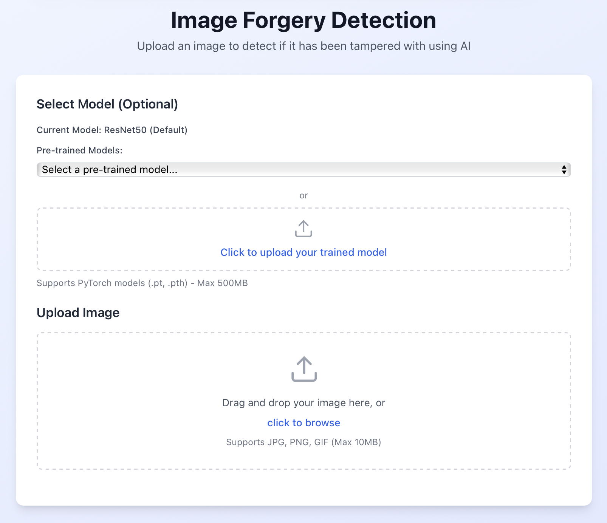
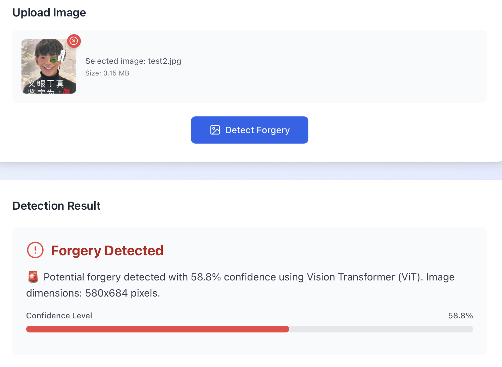

# Check Canvas - Image Forgery Detection (义眼顶帧)

AI-powered image forgery detection using CNN, Vision Transformer, and ensemble methods. Idea adopted from https://github.com/lintsinghua/VerifyVision-Pro.

## Features

- **Multi-Model Detection**: CNN + ViT + Ensemble
- **Web Interface**: React-based UI with drag-and-drop upload
- **Real-time Analysis**: GPU acceleration support
- **Model Management**: Custom model uploads
- **CASIA2 Dataset**: Pre-configured dataset

## Quick Start

### 1. Install Dependencies
```bash
npm install
pip install torch torchvision transformers scikit-learn opencv-python pillow matplotlib tqdm numpy
```

### 2. Setup Dataset
Download [CASIA2.0 dataset](https://www.kaggle.com/datasets/divg07/casia-20-image-tampering-detection-dataset/code) and extract to `CASIA2/`

### 3. Train Models
```bash
jupyter notebook CNN_vs_ViT.ipynb  # Generate cnn.pth, vit.pth
python ensemble.py                 # Create ensemble model
```

### 4. Run Application
```bash
npm run dev  # Start frontend + backend
# Visit http://localhost:5173
```

## Usage

### Web Interface
1. Upload image (drag & drop or click)
2. Select model (pre-trained or custom)
3. Click "Analyze" 
4. View results with confidence scores

#### Interface Screenshots
**Main Interface** 
**Detection Interface** 

### API Endpoints
- `POST /api/detect` - Upload image for detection
- `GET /api/models` - List available models
- `POST /api/models/upload` - Upload custom model

## Architecture

- **CNN**: ResNet50 backbone, 92%+ accuracy
- **ViT**: CLIP-based encoder for subtle manipulations  
- **Ensemble**: Voting classifier with frequency features

## Configuration

Edit `.env` file:
- `MODEL_TYPE`: 'cnn', 'vit', or 'ensemble'
- `DEVICE`: 'cuda' or 'cpu'
- `MAX_IMAGE_SIZE_MB`: Upload limit (default: 10MB)

## Project Structure
```
├── src/          # React frontend
├── api/          # Express.js backend  
├── CASIA2/       # Dataset directory
├── models/       # Trained models
└── UI/           # Interface screenshots
```
